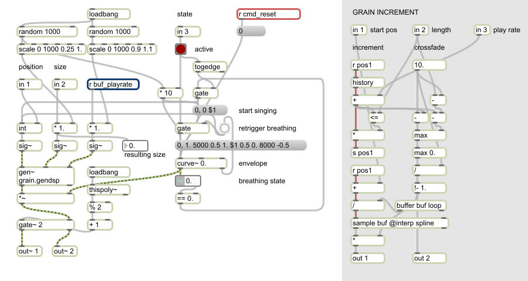
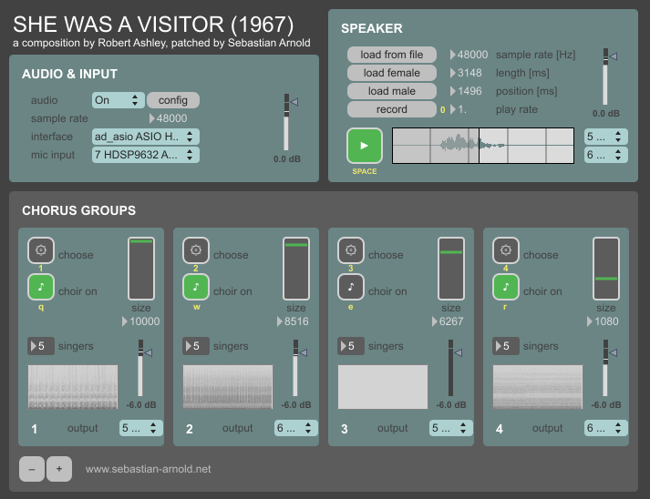

# She Was A Visitor

"She Was A Visitor" is a vocal piece written by [Robert Ashley](https://en.wikipedia.org/wiki/Robert_Ashley) in 1967. It is based completely on speech and is performed by one single speaker and number of singers that are divided in chorus groups. A copy of the original score can be obtained [here](http://www.worldcat.org/oclc/678777368). This recreation is an attempt to model the chorus digitally using Max 6, allowing a computer to perform the piece on its own or interactively. Please see the included [essay paper](She-Was-A-Visitor-recreation.pdf) for more details on the approach and technical documentation.

This Max 6 Patch was created in 2014 by [Sebastian Arnold](http://blog.sebastian-arnold.net/2014/10/she-was-a-visitor/) during the course "A History of Experimental Music in 10 1/2 Chapters" by Nicolas Collins at Technische Universität Berlin, Fachgebiet Audiokommunikation.

Included speaker voices were kindly provided by Tanja Geke and Elias Emken.

Here is a screenshot of the singer DSP model:

## RUNNING "She Was A Visitor"

1. extract the ZIP file to a directory of your choice

2. run visitor.exe (Windows) or visitor.app (OSX)

3. set up the audio connections:
   - select your audio interface
   - select a microphone input channel (optional)
   - select output channels for speaker

4. configure your chorus:
   - add or delete chorus groups using the +/- buttons (optional)
   - change the number of singers per group (optional)
   - select an output channel for each group

5. start the processing by switching the audio checkbox to ON

## PERFORMING "She Was A Visitor"

1. start with the speaker by loading a file or click "record" to use your own input

2. use the "play" button (or hit the space bar) to start end end the speaker

3. each chorus leader will sustain a moment in time if you press the "choose" button

4. the chorus group will follow the leader if it is switched on using the "note" button

5. after switching a chorus group off, the sound will slowly decay

6. the "size" parameter changes the grain size of the chorus, try it!

A performance for 12-speaker multichannel was recorded at [TU Berlin Electronic Studio](https://www.ak.tu-berlin.de/menue/elektronisches_studio/raum_und_ausstattung/) and can be heard at <https://soundcloud.com/experimental-music/sie-liebte-den-mond-1>.

### KEYBOARD MAPPING

All of the key mappings are displayed in yellow color:

- SPACE   -   start / stop the speaker
- 0       -   start / stop recording
- 1-8     -   choose a time position for chorus group 1-8
- q-i     -   start / stop chorus 1-8

### MIDI MAPPING

MIDI bindings are available for Mackie Control compatible devices:

- pitch bend CH 1-8 (channel faders)  -   control grain size of chorus 1-8
- CC 0-7 (record)                     -   start / stop chorus 1-8
- CC 8-15 (solo)                      -   choose a time position for chorus group 1-8

## CHANGELOG

02.02.2019 v1.2
- sources released under GPL

27.10.2014 v1.1
- fixes and documentation for release

19.03.2014 v1.0
- initial version
